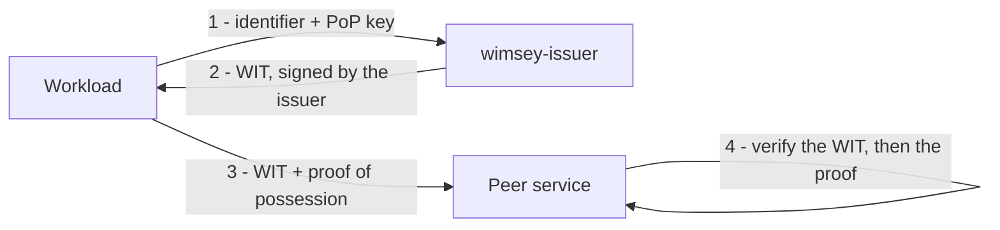

# wimsey

[](https://github.com/kanywst/wimsey/actions/workflows/ci.yml)
[](https://scorecard.dev/viewer/?uri=github.com/kanywst/wimsey)
[](LICENSE)

**A vendor-neutral reference implementation of the IETF
[WIMSE](https://datatracker.ietf.org/wg/wimse/about/) workload-identity specs,
in Rust.**

WIMSE (Workload Identity in Multi System Environments) standardizes how software
workloads prove their identity to one another. The working group publishes
specifications but no reference code — `wimsey` fills that gap with a clean,
spec-faithful implementation plus cross-implementation conformance vectors that
any vendor can validate against.

> **Pre-alpha.** The specs are Internet-Drafts (no RFC yet) and `wimsey` pins
> specific draft revisions in [`SPEC-MAP.md`](SPEC-MAP.md). Not production-ready.

## Isn't that what SPIRE does?

SPIRE is a workload identity *platform*: it attests workloads, manages a CA, and
delivers credentials at runtime. `wimsey` is not that, and is not trying to be.
It is two narrower things:

- **An executable reading of the WIMSE drafts.** The working group publishes
  specifications and no reference code, so the only way to find out what a
  sentence means today is to implement it. Each crate pins one draft revision,
  and where the code does not meet its pinned draft that is
  [written down](SPEC-MAP.md#known-divergences) rather than left implied.
- **Conformance vectors any implementation can be held to.** `conformance/`
  records inputs, the exact bytes they must produce, and — for every negative
  case — a language-neutral code naming *why* it must be rejected. Rejecting an
  expired token because the payload failed to parse is still wrong, and a
  byte-diff of your own output will never tell you so.

So the relationship is complementary. SPIFFE identifiers are first-class here
(`spiffe://` parses alongside the newer `wimse://` scheme), the WIC is the
X.509-SVID shape, and the bundled issuer is scoped to reference and
experimentation — it exists to exercise the protocol, not to replace SPIRE.

If you are running workload identity in production today, use SPIRE. If you are
implementing the WIMSE drafts, or want to check an implementation against
somebody else's reading of them, that is what this is for.

## How it works

A workload gets a signed **Workload Identity Token (WIT)** from an issuer, then
proves possession of its key whenever it calls a peer.



The proof of possession is one of three interchangeable bindings:

- a **Workload Proof Token (WPT)** — a DPoP-style JWT bound to the WIT;
- an **RFC 9421 HTTP Message Signature** over the request carrying the WIT;
- **mutual TLS** with a **Workload Identity Certificate (WIC)**, the X.509-SVID
  shape SPIFFE uses.

## Components

| Crate | Role | Spec |
| --- | --- | --- |
| `wimsey-identifier` | Workload identifier URI (`spiffe` and `wimse`) | `draft-ietf-wimse-identifier` |
| `wimsey-wit` | Workload Identity Token (WIT / WIC) | `draft-ietf-wimse-workload-creds` |
| `wimsey-wpt` | Workload Proof Token | `draft-ietf-wimse-wpt` |
| `wimsey-httpsig` | HTTP Message Signatures binding | `draft-ietf-wimse-http-signature` |
| `wimsey-mtls` | mTLS binding (WIC) | `draft-ietf-wimse-mutual-tls` |
| `wimsey-cli` | The `wimsey` command-line tool | — |
| `wimsey-demo` | End-to-end demo: two services and a middlebox | — |
| `wimsey-issuer` | Experimental HTTP issuer | — |

## Quick start

The fastest way to see the whole trust chain is to run it:

```bash
cargo run -p wimsey-demo
```

It issues a WIT, signs a request with the proof-of-possession key, forwards it
through a middlebox that reads and annotates the request, verifies it at the
far end, and then shows the same middlebox rerouting the request and being
refused. Every step asserts, so it is also a CI gate.

To drive the pieces yourself:

```bash
# Install the CLI once (or prefix each command with `cargo run -p wimsey-cli --`).
cargo install --path crates/cli

# An issuer key and a workload proof-of-possession key.
wimsey key generate --out issuer.jwk
wimsey key generate --out pop.jwk

# Issue a WIT for a workload, then verify it.
wimsey wit issue --issuer-key issuer.jwk --cnf-key pop.jwk \
  --sub spiffe://example.org/api --iss https://issuer.example > wit.txt
wimsey wit verify --issuer-jwk issuer.jwk --token-file wit.txt

# Prove possession with a WPT, then verify the WIT and proof together.
wimsey wpt new --pop-key pop.jwk --wit "$(cat wit.txt)" \
  --aud https://service.example/transfer > wpt.txt
wimsey wpt verify --issuer-jwk issuer.jwk --wit "$(cat wit.txt)" \
  --aud https://service.example/transfer --proof "$(cat wpt.txt)"
```

The same WIT can instead be carried in an RFC 9421 HTTP signature, where the
audience is a signature parameter rather than a claim:

```bash
wimsey httpsig sign --pop-key pop.jwk --authority service.example \
  --path /transfer --wit "$(cat wit.txt)" \
  --aud https://service.example/transfer
```

Or in an mTLS client certificate. Run `wimsey --help`, or start the issuer with
`cargo run -p wimsey-issuer`.

## Documentation

- [Roadmap](ROADMAP.md) — the phased plan toward CNCF Sandbox readiness.
- [Spec map](SPEC-MAP.md) — the pinned IETF draft revisions per crate.
- [CNCF Sandbox readiness](docs/cncf-sandbox.md) — criteria checklist and draft
  application.
- [Conformance vectors](conformance/README.md) — the cross-implementation
  vector format, for other WIMSE implementations.
- [Implementation status](docs/implementation-status.md) — the RFC 7942 entries
  for the WIMSE drafts, kept in step with what the code actually does.
- [Fuzzing](fuzz/README.md) — the parser fuzz targets and how to run them for
  longer than CI does.
- [Releasing](RELEASING.md) — cadence, versioning, and how to verify a release's
  signatures and SBOM.
- [Changelog](CHANGELOG.md).

## Community

Contributions are welcome under the [DCO](CONTRIBUTING.md). Please read the
[Code of Conduct](CODE_OF_CONDUCT.md), the [governance](GOVERNANCE.md) and
[maintainers](MAINTAINERS.md), and the [security policy](SECURITY.md). Using
`wimsey`? Add yourself to [`ADOPTERS.md`](ADOPTERS.md).

## License

Licensed under the [Apache License, Version 2.0](LICENSE).
