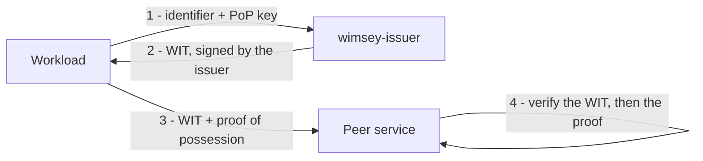

# wimsey

[](https://github.com/kanywst/wimsey/actions/workflows/ci.yml)
[](https://scorecard.dev/viewer/?uri=github.com/kanywst/wimsey)
[](LICENSE)

**A vendor-neutral reference implementation of the IETF
[WIMSE](https://datatracker.ietf.org/wg/wimse/about/) workload-identity specs,
in Rust.**

WIMSE (Workload Identity in Multi System Environments) standardizes how software
workloads prove their identity to one another. The working group publishes
specifications but no reference code — `wimsey` fills that gap with a clean,
spec-faithful implementation plus cross-implementation conformance vectors that
any vendor can validate against.

> **Pre-alpha.** The specs are Internet-Drafts (no RFC yet) and `wimsey` pins
> specific draft revisions in [`SPEC-MAP.md`](SPEC-MAP.md). Not production-ready.

## How it works

A workload gets a signed **Workload Identity Token (WIT)** from an issuer, then
proves possession of its key whenever it calls a peer.



The proof of possession is one of three interchangeable bindings:

- a **Workload Proof Token (WPT)** — a DPoP-style JWT bound to the WIT;
- an **RFC 9421 HTTP Message Signature** over the request carrying the WIT;
- **mutual TLS** with a **Workload Identity Certificate (WIC)**, the X.509-SVID
  shape SPIFFE uses.

## Components

| Crate | Role | Spec |
| --- | --- | --- |
| `wimsey-identifier` | Workload identifier URI scheme | `draft-ietf-wimse-identifier` |
| `wimsey-wit` | Workload Identity Token (WIT / WIC) | `draft-ietf-wimse-workload-creds` |
| `wimsey-wpt` | Workload Proof Token | `draft-ietf-wimse-wpt` |
| `wimsey-httpsig` | HTTP Message Signatures binding | `draft-ietf-wimse-http-signature` |
| `wimsey-mtls` | mTLS binding (WIC) | `draft-ietf-wimse-mutual-tls` |
| `wimsey-cli` | The `wimsey` command-line tool | — |
| `wimsey-issuer` | Experimental HTTP issuer | — |

## Quick start

```bash
# Install the CLI once (or prefix each command with `cargo run -p wimsey-cli --`).
cargo install --path crates/cli

# An issuer key and a workload proof-of-possession key.
wimsey key generate --out issuer.jwk
wimsey key generate --out pop.jwk

# Issue a WIT for a workload, then verify it.
wimsey wit issue --issuer-key issuer.jwk --cnf-key pop.jwk \
  --sub spiffe://example.org/api --iss https://issuer.example > wit.txt
wimsey wit verify --issuer-jwk issuer.jwk --token-file wit.txt

# Prove possession with a WPT, then verify the WIT and proof together.
wimsey wpt new --pop-key pop.jwk --wit "$(cat wit.txt)" \
  --aud https://service.example/transfer > wpt.txt
wimsey wpt verify --issuer-jwk issuer.jwk --wit "$(cat wit.txt)" \
  --aud https://service.example/transfer --proof "$(cat wpt.txt)"
```

The same WIT can instead be carried in an RFC 9421 HTTP signature
(`wimsey httpsig sign|verify`) or an mTLS client certificate. Run
`wimsey --help`, or start the issuer with `cargo run -p wimsey-issuer`.

## Documentation

- [Roadmap](ROADMAP.md) — the phased plan toward CNCF Sandbox readiness.
- [Spec map](SPEC-MAP.md) — the pinned IETF draft revisions per crate.
- [CNCF Sandbox readiness](docs/cncf-sandbox.md) — criteria checklist and draft
  application.
- [Changelog](CHANGELOG.md).

## Community

Contributions are welcome under the [DCO](CONTRIBUTING.md). Please read the
[Code of Conduct](CODE_OF_CONDUCT.md), the [governance](GOVERNANCE.md) and
[maintainers](MAINTAINERS.md), and the [security policy](SECURITY.md). Using
`wimsey`? Add yourself to [`ADOPTERS.md`](ADOPTERS.md).

## License

Licensed under the [Apache License, Version 2.0](LICENSE).
